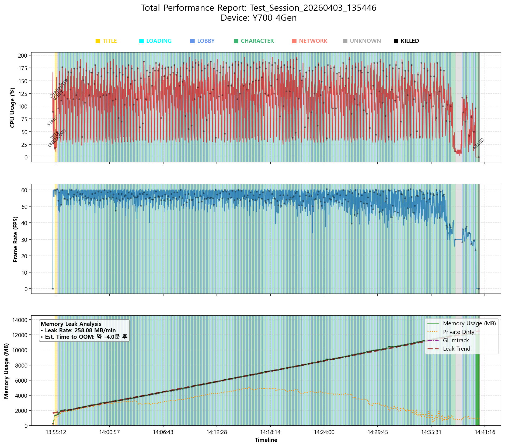
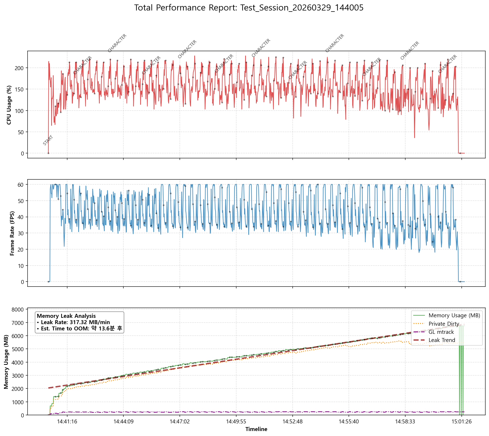

# 트릭컬 리바이브 모바일 앱 성능 테스트 자동화 v0.5

## 배경
상용 모바일 성능 측정 도구는 비용 부담으로 개인 프로젝트에서 활용하기 어려웠습니다.

직무에서 이슈 발생 시 logcat과 dumpsys를 개인적으로 분석하던 경험을 바탕으로, ADB와 Python을 활용해 CPU, FPS, 메모리 지표를 수집하는 자동화 도구를 직접 구현했습니다.

초기에는 단순 지표 수집을 목표로 했지만, 장시간 반복 테스트 과정에서 메모리가 지속적으로 증가하는 패턴을 발견했습니다.
추가 분석 결과 Private Dirty는 일시적으로 감소했지만, Total PSS는 단 한 번도 감소하지 않고 지속적으로 누적되는 현상을 확인했습니다.

이후 SwapFree 소진 시점에 OS에 의해 강제 종료되는 패턴이 3회 독립 테스트와 2개 단말에서 동일하게 재현됐고, 이를 통해 메모리 누수를 확인했습니다.

이 과정에서 데이터 기반으로 문제를 재현하고 원인을 추론하는 경험까지 확장할 수 있었습니다.

## 동작 개요
앱 실행부터 캐릭터 리스트 스크롤 구간까지의 사용자 동작을 자동화하여 반복 실행하고 다음 성능 지표를 수집합니다.
- CPU 사용률
- FPS
- PSS 기반 메모리 사용량

수집된 데이터를 기반으로 성능 변화를 그래프로 시각화하여 장시간 구동 시 발생하는 성능 저하 패턴을 분석합니다.

## 기술 스택
- Python
- Appium
- ADB
- OpenCV
- Pillow
- Tesseract OCR
- matplotlib
- SurfaceFlinger

## 상태 머신 기반 자동화 구조
다음 6개의 상태를 기준으로 화면을 인식하고 동작을 분기하는 상태 머신을 설계하였습니다.
- TITLE
- LOADING
- LOBBY
- CHARACTER
- NETWORK
- POPUP
각 상태 전환을 감지하여 해당 화면에서 필요한 동작(터치, 스크롤 등)을 수행하도록 구현했습니다.

## 주요 설계 결정
### 이미지 매칭 → 픽셀 색상 기반 상태 감지
초기에는 OpenCV 기반 이미지 매칭을 사용하여 화면 상태를 판별하려 했으나, 다음과 같은 문제에 직면했습니다.
- 템플릿 이미지 방식은 기기별 해상도 차이로 인해 매칭이 불가능
- 렌더링 타이밍에 따라 인식 결과가 달라지는 문제가 있어 일관된 상태 판단이 어려움

이 문제를 해결하기 위해 특정 좌표의 픽셀 색상을 기준으로 상태를 판별하는 방식으로 변경하였습니다.
해당 방식은 이미지 매칭 대비 속도와 안정성이 크게 향상되었습니다.
특히 픽셀 기반 방식은 특정 UI 상태에서 변하지 않는 색상 값을 기준으로 판단하기 때문에, 동일 UI 레이아웃 기준에서는 해상도나 스케일링 변화에도 안정적으로 동작한다는 장점이 있습니다.

### Appium 스크린샷 → ADB exec-out / adb screencap
Appium 스크린샷 API는 서버 부하로 인해 Appium 서버가 종료되는 문제가 발생하여 ADB 직접 스크린샷 방식으로 변경했습니다.
다만 단말별로 다음과 같이 동작을 분기합니다.
- 일반 단말: adb exec-out screencap 방식 사용
- 갤럭시 Z 폴드5 (SM-F946N): adb exec-out screencap 사용

폴드 5의 경우 Windows 환경에서 개행 문자(\r\n, \n)가 혼입되며 바이너리 스트림이 오염되는 문제가 발생했으며, 이로 인해 이미지 디코딩이 실패하여, 파일로 저장 후 pull하는 방식으로 별도 처리했습니다.

### 그래프 시각화 개선 (상태 기반 배경 구분)

장시간 테스트 데이터를 그래프로 시각화하는 과정에서, 기존 방식은 상태 전환 시점이 직관적으로 드러나지 않아 특정 구간에서 발생하는 성능 변화의 원인을 파악하기 어려운 문제가 있었습니다.

이를 개선하기 위해 상태 머신에서 판단된 화면 상태를 기준으로 그래프 배경에 색상을 적용하여 구간을 시각적으로 구분하도록 변경했습니다.

또한, 모든 시점에 라벨을 표시하는 대신 각 상태가 처음 등장하는 시점에만 상태 값을 출력하도록 수정하여 가독성을 유지하면서 상태 전환 흐름을 명확히 파악할 수 있도록 했습니다.

이러한 시각화 방식은 단순 시간 흐름 기반 그래프에서 확인하기 어려웠던, 특정 UI 상태에서 발생하는 성능 변화 패턴을 직관적으로 식별할 수 있게 해줍니다.
예를 들어, 반복적으로 진입하는 특정 상태에서 메모리 증가가 누적되는지 여부를 그래프 상에서 직접 확인할 수 있습니다.

또한 실제 화면 전환 시점과 데이터 수집 시점 간의 미세한 타이밍 오차가 존재하더라도, 성능 변화가 발생한 구간의 화면 상태를 해석하는 데 충분한 정보를 제공합니다.

### FPS 계산 방식 변경

Unity 기반 앱은 Android View 시스템을 사용하지 않고 별도의 렌더링 파이프라인을 사용하기 때문에, Appium에서 제공하는 Janky frames 지표가 정상적으로 수집되지 않거나 의미 있는 값을 반환하지 않는 문제가 있었습니다.
이를 해결하기 위해 SurfaceFlinger latency 데이터를 기반으로 프레임 간 시간 간격을 직접 계산하여 FPS를 산출하도록 구현했습니다.

### 메모리 지표 세분화
초기에는 Total PSS 단일 값으로 메모리 사용량을 분석했습니다.
테스트를 진행하면서 Private Dirty와 unknown_mem 수치가 함께 증가하는 패턴을 확인했고, 단일 지표만으로는 원인 추정이 어렵다고 판단하여 다음 지표를 추가로 수집하도록 변경했습니다.

- TOTAL PSS
- private_dirty
- gl_mtrack
- egl_mtrack
- native_heap
- unknown_mem

이를 통해 메모리 누수 발생 영역을 보다 구체적으로 추정할 수 있도록 개선했습니다.

### 세션 재연결 구조
장시간 반복 테스트 중 메모리 누수로 인해 화면 지연 및 앱 종료가 발생했고, 이 과정에서 Appium 세션이 비정상적으로 종료되는 문제가 확인되었습니다.

테스트 중단을 방지하기 위해 예외 발생 시 드라이버를 종료한 뒤 재생성하는 세션 재연결 로직을 구현했습니다. 다만, 앱이 강제 종료되는 시점을 관측하는 것이 목적이었기 때문에, 모든 반복에서 세션을 강제로 재연결하는 구조는 적용하지 않고, 예외 발생 시에만 제한적으로 수행하도록 설계했습니다.
이를 통해 테스트의 연속성을 유지하면서도 장애 발생 시점에 대한 관측을 동시에 확보할 수 있도록 설계했습니다.

### UNKNOWN 상태 처리
화면 상태를 정상적으로 판별할 수 없는 경우를 UNKNOWN 상태로 정의하고, 테스트 흐름을 명확히 분기하도록 설계했습니다.
UNKNOWN 상태 진입 시 다음 데이터를 수집합니다.
- 스크린샷 저장
- 메모리 덤프 수집
- 앱 프로세스 생존 여부 확인

이를 통해 단순 인식 실패와 실제 앱 종료 상황을 구분할 수 있습니다.
- OOM 등으로 인한 프로세스 종료
- 화면 전환 지연 및 인식 실패 또는 UNKNOWN 상태가 일정 시간(60초) 이상 지속될 경우

상기 앱 종료 상태를 구분하여 정상적인 테스트 진행이 불가능하다고 판단했을 때, 해당 회차를 종료하도록 설계했습니다.

## 수집 지표
- CPU Usage
- FPS (SurfaceFlinger 기반)
- Private Dirty
- GL mtrack
- Native Heap
- EGL mtrack

## 주요 결과
반복 실행 테스트를 통해 메모리 사용량이 점진적으로 증가하는 패턴을 확인했습니다.
구간별 CPU/GPU 사용량을 시각화하여 특정 화면 전환 구간에서 성능 저하가 발생하는 지점을 분석할 수 있었습니다.

> **누수 원인 추정**

UI 반복 진입 시 Total PSS가 지속적으로 증가하는 패턴이 확인되었고, 중간에 Private Dirty와 Unknown 값이 일부 감소하는 구간이 존재했습니다.
이를 통해 GC 또는 메모리 압축 동작이 실제로 발생한 것으로 판단했습니다. 하지만 해당 구간 이후에도 Total PSS는 단 한 번도 감소하지 않고 계속 증가했기 때문에, GC로 회수되지 않는 메모리가 누적되고 있을 가능성이 있다고 판단했습니다.

UI 전환 이후 Unknown 메모리가 증가하는 패턴이 확인되었는데, 이는 Managed 객체는 해제되었지만 네이티브 리소스가 해제되지 않았을 가능성이 있다고 판단했습니다. 또한 GL mtrack 및 EGL mtrack은 전체 테스트 구간에서 큰 변동 없이 일정 수준을 유지한 반면, Unknown 메모리 영역이 Total PSS 증가와 함께 지속적으로 증가하는 패턴을 확인했습니다.
이는 시스템에서 명확히 분류되지 않는 메모리 영역(Unknown)이 Total PSS 증가와 함께 지속적으로 증가하는 패턴이 관찰된 결과입니다.

또한 GL mtrack 및 EGL mtrack은 큰 변동이 없는 반면 Unknown 영역만 증가하는 양상이 확인되어, 해당 구간에서 네이티브 메모리 영역의 해제가 정상적으로 이루어지지 않았을 가능성이 있다고 판단했습니다.

최종적으로 Total PSS가 단말의 메모리 임계치에 도달한 시점에서 프로세스가 Signal 9로 종료되었으며, SwapFree 소진 시점과 종료 타이밍이 일치하는 패턴이 반복적으로 관찰되었습니다.

또한 동일한 테스트 시나리오에서 3회 반복 테스트 및 2개 단말에서 동일한 종료 패턴이 재현된 점을 근거로, 해당 종료는 OS OOM Killer에 의해 발생한 것으로 판단했습니다.

## 테스트 결과 요약

| | 항목 | 결과 |
|------|------|------|
| 테스트 기기 | LEGION Y700 4Gen | Galaxy Fold 5 |
| 총 테스트 시간 | 약 54분 | 약 29분 |
| 총 반복 횟수 | 129번 | 72번 |
| 시작 메모리 | 675MB | 568MB |
| Leak Rate | 256.28 MB/min | 317.32 MB/min |
| 종료 원인 | OS Signal 9 (OOM Killer) | OS Signal 9 (OOM Killer) |

상세 데이터는 [Y700 Performance Log](./result/Y700/perf_log.jsonl) 및 [Fold5 Performance Log](./result/Fold5/perf_log.jsonl) 참조

## 실행 환경
- Windows 10 / 11
- Appium-Python-Client 5.2.7
- selenium 4.41.0
- opencv-python 4.13.0.92
- pytesseract 0.3.13
- Pillow 12.1.1
- pandas 3.0.1
- matplotlib 3.10.8
- numpy 2.4.3
- Tesseract OCR (C:/Tesseract-OCR/tesseract.exe) / 한국어팩(C:/Tesseract-OCR/tessdata/kor.traineddata)

## 향후 개선 계획
- 네트워크 팝업 대응 로직 개선
- 다중 기기 동시 테스트 지원
- GL mtrack / EGL mtrack 파싱 정확도 개선
